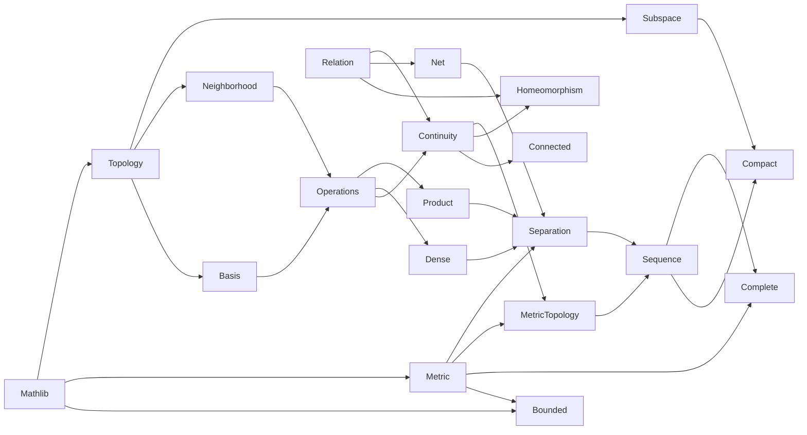

Point-set topology in Lean 4.

Loosely based on General Topology by Willard (1970).

View the main file on Lean 4 web server: [Link](https://live.lean-lang.org/#url=https://github.com/mdnestor/basic_topology/blob/master/basic_topology/T0_topology.lean)

Dependency graph:

  

